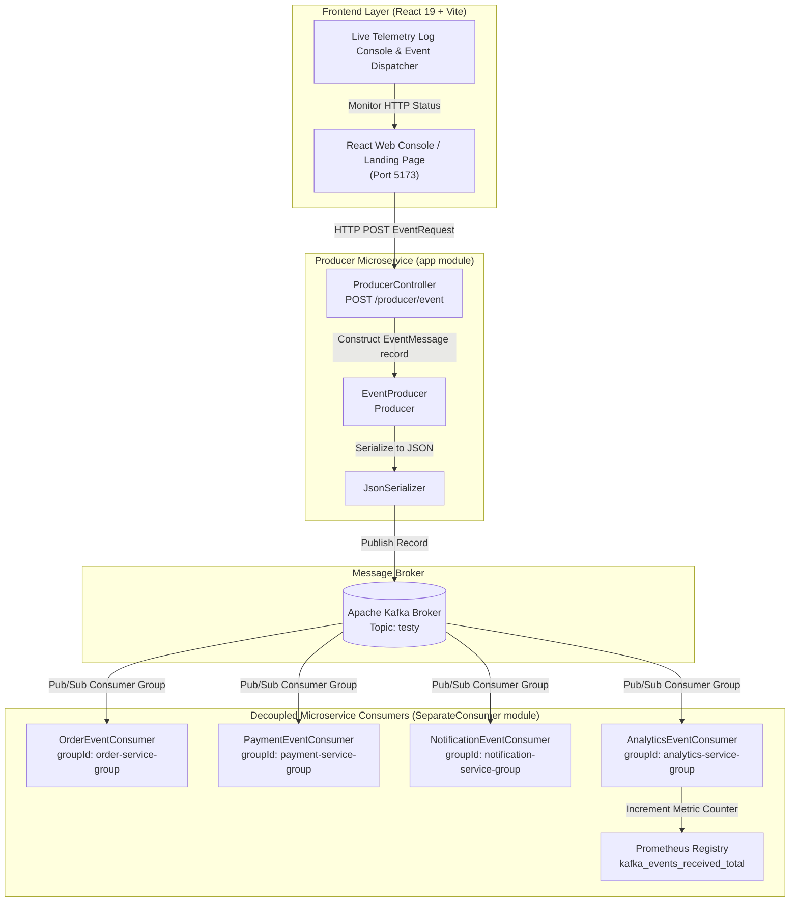

# Event-Driven Microservices Platform with Spring Boot, Apache Kafka & React 19

[](https://www.oracle.com/java/)
[](https://spring.io/projects/spring-boot)
[](https://kafka.apache.org/)
[](https://react.dev/)
[](https://vitejs.dev/)
[](https://prometheus.io/)
[](https://gradle.org/)

A full-stack event-driven microservices ecosystem featuring a **React 19 + Vite** frontend interactive platform, a **Spring Boot REST Producer API**, native JSON serialization with **Apache Kafka**, and decoupled consumer microservices (**Order**, **Payment**, **Notification**, and **Analytics** with real-time **Prometheus telemetry metrics**).

---

## 🏗️ System Architecture



---

## ✨ Key Features

- **Decoupled Architecture**: Independent Producer microservice (`app`) and standalone Consumer microservice (`SeparateConsumer`) communicating asynchronously over Kafka.
- **Typed Event Envelope Model**: Java 21 record-based domain models (`EventMessage`, `EventRequest`, `EventType`) carrying unique event IDs, source metadata, timestamps, and dynamic payload data.
- **Native Spring Kafka JSON Serialization**: Configured `JsonSerializer` and `StringJsonMessageConverter` for seamless non-blocking object-to-JSON serialization across Kafka topics.
- **Parallel Pub/Sub Consumer Groups**: Multiple isolated consumer groups (`order-service-group`, `payment-service-group`, `notification-service-group`, `analytics-service-group`) processing event streams independently without blocking each other.
- **Prometheus Telemetry**: Real-time metric counter (`kafka_events_received_total`) backing analytics monitoring via Prometheus standard registry (`simpleclient`).
- **Glassmorphic React 19 Telemetry UI**: Interactive frontend featuring a real-time event dispatcher, live log drawer terminal, course catalog, interactive architecture flow explainer, and toast alerts.

---

## 🛠️ Tech Stack

| Layer | Technology | Description |
| :--- | :--- | :--- |
| **Frontend Framework** | React 19, Vite 8 | Interactive single-page app with glassmorphism UI & telemetry console |
| **Backend Framework** | Java 21, Spring Boot 3.2.11 | REST API Producer & decoupled Consumer microservices |
| **Messaging Broker** | Apache Kafka | Distributed streaming platform (Topic: `testy`) |
| **Serialization** | Spring Kafka `JsonSerializer` | Automatic JSON conversion between Java records and Kafka records |
| **Observability** | Prometheus / Actuator | Custom metric tracking (`kafka_events_received_total`) |
| **Build & Tooling** | Gradle 8 | Multi-module Java project management |

---

## 📁 Directory Structure

```text
ProducerConsumer-kafka/
├── app/                                 # Spring Boot Producer API Microservice
│   ├── build.gradle                     # Producer dependencies & Gradle config
│   └── src/main/
│       ├── java/org/example/
│       │   ├── App.java                 # Producer Application Entry Point
│       │   ├── config/
│       │   │   ├── CorsConfig.java              # Frontend CORS policy (Port 5173)
│       │   │   ├── KafkaConsumerConfig.java     # Consumer Listener & Converter Config
│       │   │   └── KafkaProducerConfig.java     # Kafka Producer & JsonSerializer Config
│       │   ├── consumer/                        # Embedded Consumer Listeners
│       │   ├── controller/
│       │   │   └── ProducerController.java     # REST Controller (POST /producer/event)
│       │   ├── model/
│       │   │   ├── EventMessage.java           # Standard Event Record Envelope
│       │   │   ├── EventRequest.java           # DTO Request Payload Record
│       │   │   └── EventType.java              # Enum Event Domain Types
│       │   └── producer/
│       │       └── EventProducer.java          # Kafka Producer Component
│       └── resources/
│           └── application.properties   # Kafka & server configuration
├── SeparateConsumer/                    # Standalone Consumer Microservice Module
│   ├── build.gradle                     # Standalone Consumer dependencies
│   └── app/src/main/
│       └── java/org/example/
│           ├── App.java                 # Consumer Application Entry Point
│           ├── config/
│           │   └── KafkaConsumerConfig.java     # Kafka JSON Deserialization Config
│           ├── consumer/
│           │   ├── AnalyticsEventConsumer.java    # Prometheus Metrics Listener
│           │   ├── NotificationEventConsumer.java # User Notification Router Listener
│           │   ├── OrderEventConsumer.java        # Order Processing Listener
│           │   └── PaymentEventConsumer.java      # Payment Settlement Listener
│           └── model/                           # Shared Event Record Definitions
├── Landing-Page/                        # React 19 + Vite Frontend Application
│   ├── package.json                     # Frontend dependencies
│   ├── vite.config.js                   # Vite configuration
│   └── src/
│       ├── components/                  # EventConsole, ArchitectureExplainer, etc.
│       ├── config/                      # eventDefinitions.js domain schemas
│       ├── App.jsx                      # App root component
│       └── LandingPage.jsx              # Core telemetry state & dispatch logic
├── settings.gradle                      # Root Gradle settings (modules: app, SeparateConsumer)
└── README.md                            # Main project technical documentation
```

---

## 🚀 Getting Started

### Prerequisites

- **Java JDK 21** or higher
- **Node.js 18+** & **npm**
- **Apache Kafka Broker** (running locally or remote broker, default configured host: `192.168.56.102:9092` or `localhost:9092`)

---

### 1️⃣ Apache Kafka Setup

Ensure Kafka and ZooKeeper / KRaft mode are running, and create the required topic `testy`:

```bash
# Create Kafka topic (if auto-creation is disabled)
kafka-topics.sh --create --topic testy --bootstrap-server localhost:9092 --partitions 1 --replication-factor 1
```

> ⚙️ **Configuration Note:**  
> Update `BOOTSTRAP_SERVERS` in `KafkaProducerConfig.java` and `KafkaConsumerConfig.java` to match your target Kafka broker IP address.

---

### 2️⃣ Start Spring Boot Producer API

Open a terminal in the repository root directory:

```bash
# On Linux/macOS
./gradlew :app:bootRun

# On Windows PowerShell
.\gradlew.bat :app:bootRun
```
The REST API server will start on port `8080`.

---

### 3️⃣ Start Standalone Consumer Microservice (Optional / Decoupled Mode)

To run the decoupled consumer microservice in a separate process:

```bash
# On Linux/macOS
./gradlew :SeparateConsumer:app:bootRun

# On Windows PowerShell
.\gradlew.bat :SeparateConsumer:app:bootRun
```

---

### 4️⃣ Start React Frontend Dashboard

1. Navigate to the `Landing-Page` directory:
   ```bash
   cd Landing-Page
   ```

2. Install dependencies:
   ```bash
   npm install
   ```

3. Launch development server:
   ```bash
   npm run dev
   ```

4. Open [http://localhost:5173](http://localhost:5173) in your browser.

---

## 📡 API Specification

### Dispatch Event to Kafka Producer
Accepts HTTP POST requests from frontend web clients or API tools and publishes structured event messages to Kafka topic `testy`.

- **Endpoint**: `POST /producer/event`
- **Content-Type**: `application/json`

#### Request Body Schema (`EventRequest`)
```json
{
  "eventType": "USER_REGISTERED | ORDER_CREATED | ORDER_CANCELLED | PAYMENT_COMPLETED | PAYMENT_FAILED | userClick",
  "data": {
    "key": "value"
  }
}
```

#### Sample `curl` Command
```bash
curl -X POST http://localhost:8080/producer/event \
  -H "Content-Type: application/json" \
  -d '{
        "eventType": "ORDER_CREATED",
        "data": {
          "orderId": "ORD-9842",
          "userId": "USER-1024",
          "amount": 149.99
        }
      }'
```

---

## 🧪 Operational Event Workflow

1. **User Action / Synthetic Simulation**: User clicks **"Buy Course"** or dispatches a synthetic microservice event from the **Event Producer** drawer.
2. **HTTP Payload Construction**: Frontend constructs an `EventRequest` payload (`eventType`, `data`) and emits an asynchronous `POST` request to `http://localhost:8080/producer/event`.
3. **Producer Processing**: `ProducerController` receives `EventRequest` and constructs an immutable `EventMessage` record with generated `eventId` and `timestamp`.
4. **Kafka Publishing**: `EventProducer` uses `Producer<String, EventMessage>` to publish the JSON-serialized record to Kafka topic `testy`.
5. **Parallel Consumer Group Execution**:
   - `OrderEventConsumer` (`order-service-group`): Processes order creation/cancellation.
   - `PaymentEventConsumer` (`payment-service-group`): Handles payment state updates.
   - `NotificationEventConsumer` (`notification-service-group`): Routes notifications.
   - `AnalyticsEventConsumer` (`analytics-service-group`): Increments Prometheus counter `kafka_events_received_total`.
6. **Telemetry Feedback**: Frontend UI updates real-time status (`PENDING` ➔ `SUCCESS HTTP 200`) inside the embedded **Event Console log viewer**.

---

## 📄 License

This project is open-source and available under the [MIT License](LICENSE).
