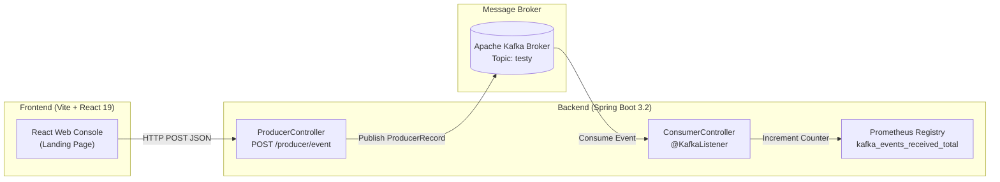

# Event-Driven Microservice with Spring Boot, Apache Kafka & React

[](https://www.oracle.com/java/)
[](https://spring.io/projects/spring-boot)
[](https://kafka.apache.org/)
[](https://react.dev/)
[](https://vitejs.dev/)
[](https://prometheus.io/)
[](https://gradle.org/)

A full-stack event-driven demonstration project illustrating real-time user interaction streaming from a **React 19** frontend through a **Spring Boot REST Producer**, queued in an **Apache Kafka** topic, and processed by a **Spring Boot Kafka Consumer** with **Prometheus metrics telemetry**.

---

## 🏗️ System Architecture



---

## ✨ Key Features

- **Real-Time Event Dispatching**: Trigger UI user actions (e.g. course purchase clicks) which are dispatched via REST API calls.
- **Kafka Producer Integration**: Spring Boot controller configured with custom Kafka `StringSerializer` properties publishing messages to the `testy` topic.
- **Asynchronous Kafka Consumer Listener**: Decoupled `@KafkaListener` consuming messages under the `metrics-consumer-group` consumer group.
- **Prometheus Telemetry**: Real-time event counter metric (`kafka_events_received_total`) exposed for monitoring and observability.
- **CORS Support**: Spring `@Configuration` enabling cross-origin requests from the React frontend running on `http://localhost:5173`.
- **Interactive Event Console UI**: Live terminal drawer inside the React app visualizing pending, successful, and failed HTTP event dispatches.

---

## 🛠️ Tech Stack

| Domain | Technology | Description |
| :--- | :--- | :--- |
| **Backend Framework** | Java 21 / Spring Boot 3.2.11 | RESTful Web APIs and dependency management |
| **Messaging Broker** | Apache Kafka | Distributed event streaming platform |
| **Kafka Integration** | Spring Kafka | `@KafkaListener` & native `KafkaProducer` integration |
| **Frontend** | React 19, Vite 8 | Modern component UI with interactive telemetry dashboard |
| **Observability** | Prometheus / Spring Actuator | Real-time metric tracking (`simpleclient`) |
| **Build System** | Gradle | Java multi-module build tool |

---

## 📁 Directory Structure

```text
ProducerConsumer-kafka/
├── app/                                 # Spring Boot Microservice
│   ├── build.gradle                     # Gradle configuration & dependencies
│   └── src/main/
│       ├── java/org/example/
│       │   ├── App.java                 # Spring Boot Main Entry Point
│       │   ├── config/
│       │   │   └── CorsConfig.java      # CORS Configuration (Port 5173)
│       │   ├── controller/
│       │   │   └── ProducerController.java # Kafka Producer REST Endpoint
│       │   └── service/
│       │       └── ConsumerController.java # @KafkaListener & Prometheus Metric
│       └── resources/
│           └── application.properties   # Kafka & Prometheus config
├── Landing-Page/                        # React 19 Frontend
│   ├── package.json                     # Frontend dependencies
│   ├── vite.config.js                   # Vite dev server configuration
│   └── src/
│       ├── LandingPage.jsx              # Main dashboard component & event handler
│       └── components/                  # UI components & Event Console
├── settings.gradle                      # Gradle root settings
└── README.md                            # Technical documentation
```

---

## 🚀 Getting Started

### Prerequisites

Ensure you have the following installed on your machine:
- **Java JDK 21** or higher
- **Node.js 18+** & **npm**
- **Apache Kafka Broker** running (default configured address: `192.168.56.102:9092` or update to `localhost:9092`)

---

### 1️⃣ Apache Kafka Setup

Ensure Kafka and ZooKeeper / KRaft mode are running, and create the required topic `testy`:

```bash
# Create topic (if not using auto-creation)
kafka-topics.sh --create --topic testy --bootstrap-server localhost:9092 --partitions 1 --replication-factor 1
```

> ⚙️ **Configuration Note:**  
> Update `BOOTSTRAP_SERVERS` in [`ProducerController.java`](file:///app/src/main/java/org/example/controller/ProducerController.java) and `spring.kafka.bootstrap-servers` in [`application.properties`](file:///app/src/main/resources/application.properties) to match your Kafka host address if different from `192.168.56.102:9092`.

---

### 2️⃣ Backend Setup (Spring Boot)

1. Open a terminal in the root project directory:
   ```bash
   ./gradlew :app:bootRun
   ```
   *(On Windows PowerShell, run `.\gradlew.bat :app:bootRun`)*

2. The server will start on port `8080`.

---

### 3️⃣ Frontend Setup (React + Vite)

1. Navigate to the `Landing-Page` directory:
   ```bash
   cd Landing-Page
   ```

2. Install dependencies:
   ```bash
   npm install
   ```

3. Launch the development server:
   ```bash
   npm run dev
   ```

4. Open `http://localhost:5173` in your browser.

---

## 📡 API Specification

### 1. Produce Event to Kafka
Publishes an event message to Kafka topic `testy`.

- **Endpoint**: `POST /producer/event`
- **Content-Type**: `application/json`

**Sample Request Body:**
```json
{
  "event": "userClick"
}
```

**Sample `curl` Command:**
```bash
curl -X POST http://localhost:8080/producer/event \
  -H "Content-Type: application/json" \
  -d '{"event":"userClick"}'
```

**Response:**
- Status `200 OK`

---

### 2. Monitoring & Metrics
Prometheus metrics endpoint enabled via Spring Boot Actuator and Prometheus client library.

- **Actuator Metrics Endpoint**: `GET http://localhost:8080/actuator/prometheus`
- **Tracked Metric**: `kafka_events_received_total` (Counter incremented on every consumed message)

---

## 🧪 Operational Workflow

1. User clicks **"Buy a course"** or triggers an interactive action on the React landing page.
2. The frontend sends an HTTP `POST` request to `http://localhost:8080/producer/event`.
3. `ProducerController` sends the record to Kafka topic `testy` and logs the partition offset.
4. `ConsumerController` listens asynchronously on topic `testy`, prints the received message to stdout, and increments `kafka_events_received_total`.
5. The React **Event Console** displays the live execution log status (`PENDING` ➔ `SUCCESS HTTP 200`).

---

## 🤝 Contributing

Contributions, issues, and feature requests are welcome! Feel free to check the issues page or submit pull requests.

---

## 📄 License

This project is open-source and available under the [MIT License](LICENSE).
